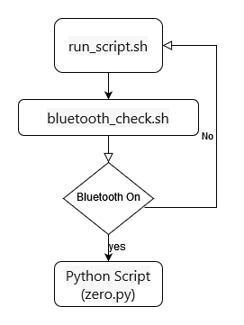

# Harsh_Enhancing_Bluetooth_Security_through_Zero_Trust_Principles_in_Automotive_Infotainment_System
Enhancing Bluetooth Security through Zero Trust Principles in Automotive Infotainment System

# What the Project Does
This project enhances the security of Bluetooth connections in automotive infotainment systems by applying Zero Trust principles. It uses Python and Bash scripts to continuously monitor Bluetooth activity and requires basic authentication at startup. If an unauthorized access attempt is detected, Bluetooth services are shut down to prevent security lapses.

# Why the Project is Useful
The project addresses the vulnerabilities of Bluetooth protocols in automotive systems. By implementing Zero Trust principles, which assume no trust by default and require rigorous authentication and verification procedures for each access attempt, the project greatly improves the security of Bluetooth connections in automotive systems.

# Getting Started with the Project
To get started with the project, you need to have Python and SQLite installed on your system. You also need to have sudo access to run certain commands.

1>Installation of the AGL

how to install an Automotive Grade Linux (AGL) image in VirtualBox:

https://docs.automotivelinux.org/en/pike/#01_Getting_Started/01_Quickstart/01_Using_Ready_Made_Images/

2>Clone the repository to your local machine.

3>Copy the all files in AGL.

4>Run the Bash script to check the Bluetooth status(continuously using corn job ) and run the Python script if Bluetooth is on.

# Detailed Explanation of the Code

The Python script **zero.py** creates a SQLite database and a table for storing usernames and hashed passwords. It provides functions for adding users, hashing passwords, authenticating users, and changing passwords. The script also includes a main function that creates the table, adds a default user, and prompts the user for the default password.

The Bash scripts **bluetooth_check.sh** and **run_script.sh** are used to check the status of Bluetooth and run the Python script if Bluetooth is on. If Bluetooth is off, the Python script is not run.

The Python script does the following:

**create_table():** Connects to the SQLite database (creates a new database if it doesn’t exist) and creates a table for storing passwords.

**hash_password(password):** Hashes the password using SHA-256.

**add_user(username, password):** Connects to the SQLite database, hashes the password, and inserts user data into the table.

**authenticate(username, password):** Connects to the SQLite database, hashes the provided password, retrieves the password hash for the given username, and checks if the username exists and if the password matches. If the authentication fails, it turns off Bluetooth.

**change_password():** Prompts the user to enter a new password and updates the password in the database.

**The Bash script does the following:**

Runs the Bluetooth check script.

If Bluetooth is on (exit status of last command is 0), it runs the Python script. Otherwise, it prints a message saying that Bluetooth is off.

# Architectural Block Diagram

Block diagram that shows how the different components of the project interact with each other

continuously running the Bash file **run_script.sh** which will call **bluetooth_check.sh**.

bluetooth_check.sh checks if Bluetooth is on.

If Bluetooth is on, the Bash script run_script.sh runs the Python script zero.py.

The Python script zero.py interacts with the SQLite database passwords.db to add a default user and authenticate the user based on the input password.

